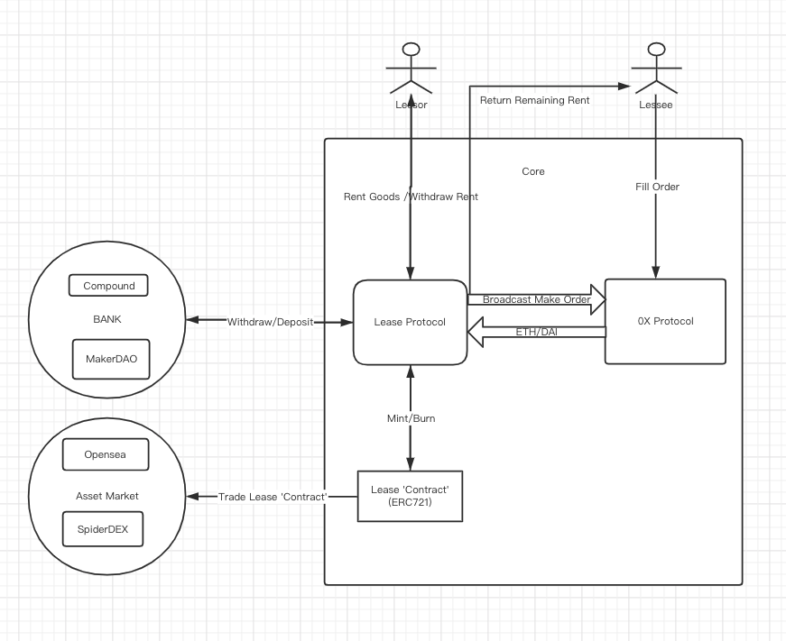

### Lease Protocol
> 此处为大概想法，具体实施细节略有差别

Lease Protocol是一个点对点的租赁协议，通过以太坊智能合约保证其公平性

出租方通过Lease智能合约编写委托出租资产(ERC20/721/1155)，再由Leasse智能合约制作订单广播到0x Mesh网络中上架到多家交易所

承租方在交易所中租赁想要的资产(ERC20/721/1155)

租赁执行后
1. 保证金和租金存入Compound或MakerDAO生息
2. Lease智能合约产生一个ERC721租赁合同，此租赁合同可由出租方提前在二级交易市场转让

租赁归还后
1. 保证金退还给承租方
2. 租金给予出租方，多余租金归还承租方
3. 利息由DAO/承租方分得

如发生违约，保证金和租金支付给出借方，多余租金归还承租方

#### Lease内角色
##### 出租方
在租赁合同中，将租赁物交付承租人使用、收益的一方
##### 承租方
租赁合同中使用租赁财产并按约向对方支付租金的当事人
##### DEFI
借助不同DEFI协议生息扩展收益
##### Asset Market
资产交易市场，可以交易NFT、FT资产

* * *
#### 2层延伸
P2P租赁 => 合同 => 借贷 => 保险 
##### 借贷
本质Lease的'ERC721合同'是由ETH、DAI质押组成且预期时间内租金可计算，由此衍生出'ERC721'合同借贷
##### 保险
保险对合同承保条件

1. A用合同向B借款，A因为某些原因违约无法偿还
2. 合同背后存在金钱支撑，但因期限原因短期无法变现

此时保险可以给B赔付，合同归保险，保险等待期限领取额外收益

##### 实时支付租金
第三方合约收取少量服务费实现小时/天/月级支付

##### 哈勃格税
TODO
